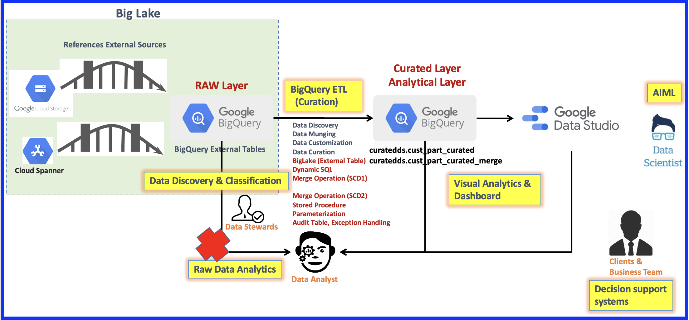

### 📌 **Cloud Modernization Use Case – Serverless BigQuery Pipeline with External Tables & Stored Procedures**
---

### ✅ **Objective**

This usecase demonstrates a **cloud-native, serverless data warehouse pipeline** built on **Google BigQuery**, leveraging **BigLake external tables** and **stored procedures** for end-to-end data processing, analytics, and business intelligence.

## Architecture Overview

  
 Click to view the E2E diagram 

  

---

### 🧩 **Pipeline Overview:**

#### **1. Raw Layer (BigLake - External Data Access):**

* **Sources:** Google Cloud Storage & Cloud Spanner
* **Tool:** BigQuery External Tables (via **BigLake**)
* **Purpose:** Seamless access to external datasets without ingestion

#### **2. ETL Curation Layer:**

* Handled by **BigQuery ETL** using:

  * Data discovery, customization, and munging
  * **Dynamic SQL**, **Stored Procedures**
  * **Merge operations (SCD1, SCD2)**
  * **Audit & Exception Handling**

#### **3. Curated Layer (Internal BigQuery Tables):**

* Tables like `curatedds.cust_part_curated` and `curatedds.cust_part_curated_merge` store transformed data
* Used for analysis and reporting

#### **4. Data Consumption & Visualization:**

* **Google Data Studio**: Dashboards and visual analytics
* **Data Scientists**: Use curated data for **AIML**
* **Business Teams**: Access reports for **decision support systems**

#### **5. Roles Involved:**

* **Data Stewards**: Classify and manage raw data
* **Data Analysts**: Perform in-depth data analysis
* **Clients/Business Users**: Use output for business insights

---

### 🎯 **Key Learning Outcomes:**

* Using **BigLake as external tables** in BigQuery
* Designing **serverless pipelines with stored procedures**
* Applying **SCD1/SCD2 merge logic** for historical tracking
* Building dashboards and ML-ready datasets from curated layers

