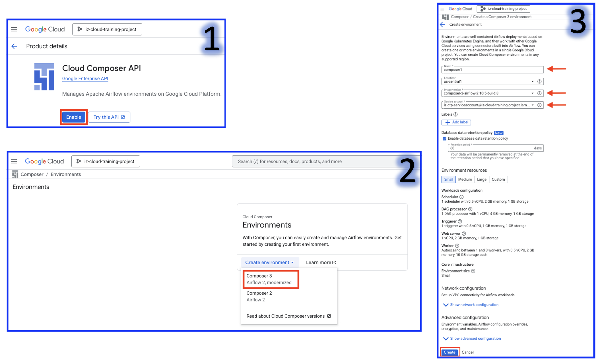

# Cloud Modernization Project: Dataproc to BigQuery with Cloud Composer Orchestration

## 1. Overview

This project, "Use Case #6: CLOUD MODERNIZATION2 & Orchestration Composer-Dataproc - BQ", focuses on modernizing data processing pipelines by leveraging Google Cloud services for data storage, processing, and orchestration, ultimately loading data into Google BigQuery for analytical purposes.

## 2. Use Cases / Project Steps

The following steps outline the core processes involved in this modernization effort:

1.  **Load Data into GCS:** Data is loaded into a Google Cloud Storage (GCS) location using a PySpark application running inside an On-premise cluster or by directly copying data to GCS. (This is a source provider responsibility).
2.  **Create DP LR Cluster:** If not already done, a Dataproc LR (Long Running) cluster is created to execute subsequent steps.
3.  **Delete Existing Data:** Data previously loaded in the BigQuery tables from Use Case 5 is deleted.
4.  **Create DAG Code:** The Directed Acyclic Graph (DAG) code is created and uploaded to the Airflow UI for orchestration.
5.  **Monitor DAG Run Status:** The status of the DAG run is monitored in the Airflow UI.
6.  **Validate Data:** Data in the BigQuery tables (Raw and Curated layers) is validated.

## 3. Architecture

The project leverages a robust Google Cloud Platform (GCP) based architecture for data processing and analytics:

* **Google Cloud Storage (GCS) - Cust Data:** Serves as the primary landing zone for raw customer data.
* **Dataproc LR Cluster:** A long-running Dataproc cluster is used for distributed data processing, leveraging **Spark SQL** for data transformations.
* **Google BigQuery (Raw Layer):** Processed or raw data from the Dataproc cluster is loaded into BigQuery's raw layer for initial storage and accessibility.
* **Google BigQuery (Curated Layer):** Further transformed and refined data is loaded into a curated layer in BigQuery, optimized for consumption by analytical tools.
* **Google Data Studio / Looker:** Used for data visualization and dashboarding, consuming data from the BigQuery curated layer.
* **Cloud Composer (Airflow Orchestration & Scheduling):** Acts as the central orchestration engine, managing and scheduling the entire data pipeline workflow, from data ingestion to BigQuery loading.

## 4. Cloud Native Distribution Cluster (Managed Service)

The project utilizes or considers various managed services for distributed processing:

* **SAAS Dataproc** (Google)
* **EMR** (AWS)
* **HDInsight** (MS)

## 5. Orchestration

Orchestration of the data pipelines is critical for automation and management:

* **Shell Script:** Basic scripting for individual tasks.
* **Scheduling - Cron Scheduler:** For traditional scheduled tasks.
* **Cloud Composer (Airflow):** The primary and most advanced orchestration tool, providing robust workflow management, scheduling, and monitoring capabilities.

## 6. Explaining the Pipelines:

In this project, we've built a comprehensive cloud-native data pipeline primarily on Google Cloud Platform. The core idea is to modernize our data processing capabilities and enable efficient analytics.

Our pipelines start with data ingestion into **Google Cloud Storage**. From there, we leverage a **Dataproc Long Running Cluster** with **Spark SQL** for heavy-duty data transformations and processing. This allows us to handle large volumes of data efficiently.

The processed data is then loaded into **Google BigQuery**, our scalable data warehouse. We maintain two layers in BigQuery: a **Raw Layer** for initial data landing and a **Curated Layer** which holds transformed, cleaned, and optimized data ready for consumption.

The entire end-to-end workflow, from data ingestion to processing in Dataproc and loading into BigQuery, is meticulously orchestrated using **Google Cloud Composer**, which is a managed Apache Airflow service. Cloud Composer allows us to define our data flows as Directed Acyclic Graphs (DAGs), enabling automated scheduling, dependency management, error handling, and monitoring. This ensures our data pipelines are reliable, repeatable, and easily scalable.

Finally, the curated data in BigQuery is utilized by tools like **Google Data Studio** or **Looker** to create interactive dashboards and reports, providing valuable business insights.

## 7. Steps to Execute the Use Case:

1. **GCP Cloud Composer (Apache Airflow) Cluster Creation:**
   1. Once for all activity
   2. Performed by Cloud Platform Engineers/Admins
   3. Composer instances will run 24/7.
   4. All the projects (Developers) will use the common (CC) Airflow Scheduler as a common platform.
   5. **Note: Ensure to terminate the Composer cluster post usage.**
   
2. **Screenshots:**


3. **Prerequisties:**

```bash
gcloud auth login
```

4. **Creating a single node long running cluster):**

```bash
gcloud dataproc clusters create singlenode-cluster-dataproc-1 --region us-central1 --zone us-central1-a --enable-component-gateway --single-node --master-machine-type e2-standard-2 --master-boot-disk-size 100 --image-version 2.1-rocky8 --project iz-cloud-training-project --max-idle 7200s
```
```bash
#Check cluster running status
gcloud dataproc clusters describe singlenode-cluster-dataproc-1 --region=us-central1
```
```bash
#Connect to cluster master/edge node
gcloud compute ssh --zone "us-central1-a" "singlenode-cluster-dataproc-1-m" --project "iz-cloud-training-project"
```

5. **Delete the tables in the BigQuery Datasets**
```bash
bq query --use_legacy_sql=false "delete from rawds.customer_raw where  1=1;"
bq query --use_legacy_sql=false "delete from curatedds.customer_curated where 1=1;"
```

**Tip # Delete the cluster** 
```bash
gcloud dataproc clusters delete singlenode-cluster-dataproc-1 --region=us-central1
```