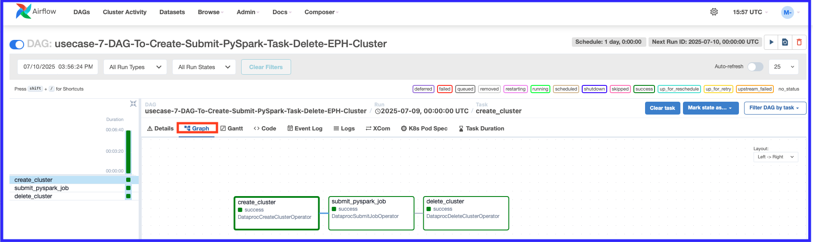

# Cloud Modernization Project: Dataproc Ephemeral Cluster for Cost-Saving with BigQuery & Cloud Composer

## 1. Overview

This project, "Use Case #7: CLOUD MODERNIZATION3 & Orchestration Composer-Dataproc EPH- BQ", focuses on modernizing data processing pipelines by leveraging Google Cloud services, specifically highlighting the use of **Dataproc Ephemeral Clusters for cost saving**. Data is processed and loaded into Google BigQuery for analytical purposes, orchestrated by Cloud Composer.

## 2. Use Cases / Project Steps

The following steps outline the core processes involved in this modernization effort, emphasizing ephemeral cluster usage:

1.  **Load Data into GCS:** Data is loaded into a Google Cloud Storage (GCS) location using a PySpark application inside an On-premise cluster or by directly copying data to GCS. (This is a source provider responsibility).
2.  **Create Ephemeral Dataproc Cluster:** A Dataproc Ephemeral cluster is created to execute the subsequent steps. This cluster is designed to be short-lived, created for a specific job and then terminated, contributing to cost savings.
3.  **Delete Existing Data:** Data previously loaded in the BigQuery tables from Use Case 6 is deleted.
4.  **Create DAG Code:** The Directed Acyclic Graph (DAG) code for the data pipeline is created and uploaded to the Airflow UI for orchestration.
5.  **Monitor DAG Run Status:** The status of the DAG run is monitored in the Airflow UI to ensure successful execution.
6.  **Validate Data:** Data in the BigQuery tables (Raw and Curated layers) is validated to confirm data integrity and correctness.

## 3. Architecture

The project leverages a robust Google Cloud Platform (GCP) based architecture for data processing and analytics, primarily within the `us-central1` region:

* **Google Cloud Storage (GCS) - Cust Data:** Serves as the primary landing zone for raw customer data.
* **Dataproc Ephemeral Cluster:** A **short-lived** Dataproc cluster that is spun up on demand for a specific job execution. It utilizes **Spark SQL** for data transformations and processing. This approach is key for **cost saving** as resources are only consumed when jobs are actively running.
* **Google BigQuery (Raw Layer):** Processed or raw data from the Dataproc cluster is loaded into BigQuery's raw layer for initial storage and accessibility.
* **Google BigQuery (Curated Layer):** Further transformed and refined data is loaded into a curated layer in BigQuery, optimized for consumption by analytical tools.
* **Google Data Studio / Looker:** Used for data visualization and dashboarding, consuming data from the BigQuery curated layer.
* **Cloud Composer (Airflow Orchestration & Scheduling):** Acts as the central orchestration engine, managing and scheduling the entire data pipeline workflow. It's responsible for provisioning the ephemeral Dataproc cluster, submitting jobs, and tearing down the cluster upon completion, ensuring efficient resource utilization.

## 4. Orchestration

Orchestration of the data pipelines is performed by **Cloud Composer (Airflow)**, which is crucial for managing the lifecycle of the ephemeral Dataproc clusters. This ensures that clusters are only active when needed, contributing directly to the cost-saving strategy.

## 5. Explaining the Pipelines (with Cost Saving Emphasis):

In this project, we've designed a highly cost-efficient cloud-native data pipeline on Google Cloud Platform. Our primary focus is on processing data and loading it into BigQuery for analytics, but with a strong emphasis on optimizing infrastructure costs.

The data journey begins with raw data being landed in **Google Cloud Storage**. For data processing and transformations, instead of using a continuously running (long-running) Dataproc cluster, we strategically leverage **Dataproc Ephemeral Clusters**. This means a Spark cluster is provisioned *only when a specific data processing job needs to run*, executes the **Spark SQL** transformations, and then is automatically *terminated upon job completion*. This 'spin-up and tear-down' model is fundamental to our **cost-saving strategy**, as we only pay for the compute resources when they are actively being used.

Post-processing, the data is loaded into **Google BigQuery**, which serves as our scalable data warehouse. We maintain a **Raw Layer** for initial ingestion and a **Curated Layer** for analytics-ready data.

The entire workflow, including the intelligent provisioning and de-provisioning of the ephemeral Dataproc clusters, is meticulously orchestrated using **Google Cloud Composer (Apache Airflow)**. ***Our Airflow DAGs are responsible for managing the entire lifecycle – from initiating the ephemeral cluster, submitting the Spark jobs, monitoring their execution, to finally tearing down the cluster.*** This automation ensures both efficiency and significant cost reduction.

Finally, the curated data in BigQuery is utilized by tools like **Google Data Studio** for powerful data visualization and reporting, enabling our stakeholders to derive insights efficiently and cost-effectively.

## 6. Steps to Execute the Use Case:

1. **Make sure Cloud Composer is created (Usecase6) and running**

2. **Delete the tables data in the BigQuery Datasets**

```bash
#Use your local PC/VM and make sure gcloud is already installed
bq query --use_legacy_sql=false "delete from rawds.customer_raw where  1=1;"
bq query --use_legacy_sql=false "delete from curatedds.customer_curated where 1=1;"

#If the BigQuery datasets are not available then create it by issuing the below commands
bq mk rawds
bq mk curatedds
```

3. **Ensure to copy the code and custs data**
```bash
#Use your local PC/VM and make sure gcloud is already installed
cd ~/Downloads/ 
git clone https://github.com/muralitheda/gcp-cloud-usecases.git #copy his repo url from github  

gsutil cp /home/hduser/Downloads/gcp-cloud-usecases/usecase7-modernization3-gcp-ephemeral-dataproc-bigquery-airflowcomposer/Usecase7_eph_cluster_gcs_bq_DAG2.py gs://iz-cloud-training-project-bucket/codebase/
gsutil cp /home/hduser/Downloads/gcp-cloud-usecases/usecase7-modernization3-gcp-ephemeral-dataproc-bigquery-airflowcomposer/code_Usecase6_step1_gcs_bq.py gs://iz-cloud-training-project-bucket/codebase/

#dataset verification : custs
gsutil cat gs://iz-cloud-training-project-bucket/custs | head -n 5

```

4. **Create/Download the following DAG Code, modify project_id & upload to the Airflow DAG GCS bucket**
* Note: This DAG is using the same usecase5 pyspark code we generated in usecase6
```python
"""
FileName: Usecase7_eph_cluster_gcs_bq_DAG2.py
"""
import os
import datetime
from airflow import models
from airflow.providers.google.cloud.operators.dataproc import (
   DataprocCreateClusterOperator,
   DataprocSubmitJobOperator,
   DataprocDeleteClusterOperator,
)
from airflow.providers.google.cloud.sensors.dataproc import DataprocJobSensor
from airflow.utils.dates import days_ago

PROJECT_ID = "iz-cloud-training-project"
CLUSTER_NAME="singlenode-ondemand-ephemeral-dataproc-cluster-1"
REGION = "us-central1"
ZONE = "us-central1-a"
PYSPARK_CODE1_URI = "gs://iz-cloud-training-project-bucket/codebase/code_Usecase6_step1_gcs_bq.py"
BIGQUERY_CONNECTOR_JAR="gs://spark-lib/bigquery/spark-3.1-bigquery-0.32.2.jar"

default_args = {
    "start_date": days_ago(1),
    "project_id": PROJECT_ID,
}

with models.DAG(
    "usecase-7-DAG-To-Create-Submit-PySpark-Task-Delete-EPH-Cluster",
    default_args=default_args,
    schedule_interval=datetime.timedelta(days=1),  
) as dag:
   
    # Define cluster configuration for a single-node cluster
    cluster_config = {
        "master_config": {
            "num_instances": 1,
            "machine_type_uri": "e2-standard-4",
            "disk_config": {"boot_disk_type": "pd-standard", "boot_disk_size_gb": 50},
        },
        "worker_config": {
            "num_instances": 0,  # Single-node cluster doesn't have worker nodes
        },
        "software_config": {
            "optional_components": [],
            "properties": {"spark:spark.jars": BIGQUERY_CONNECTOR_JAR},
            "image_version": "2.1-rocky8",
        },
    }

    # Define the cluster creation task
    create_cluster = DataprocCreateClusterOperator(
        task_id='create_cluster',
        project_id=PROJECT_ID,
        region=REGION,
        cluster_name=CLUSTER_NAME,
        cluster_config=cluster_config,
    )

    # Define the PySpark job parameters
    pyspark_job_params = {
        "reference": {"project_id": PROJECT_ID},
        "placement": {"cluster_name": CLUSTER_NAME},
        "pyspark_job": {"main_python_file_uri": PYSPARK_CODE1_URI},
    }

    # Define the PySpark job submission task
    submit_pyspark_job = DataprocSubmitJobOperator(
        task_id="submit_pyspark_job", 
        job=pyspark_job_params, 
        region=REGION, 
        project_id=PROJECT_ID,
    )

    # Define the cluster deletion task
    delete_cluster = DataprocDeleteClusterOperator(
        task_id='delete_cluster',
        project_id=PROJECT_ID,
        region=REGION,
        cluster_name=CLUSTER_NAME,
        trigger_rule='all_done',  # Ensure cluster deletion runs even if the job fails
    )

    # Set task dependencies
    create_cluster >> submit_pyspark_job >> delete_cluster

```

5. **Composer Code Copy into the Composer DAGs folder**

* **Option #1 Using gsutil copy into Composer DAGs bucket**  
```bash
gsutil cp gs://iz-cloud-training-project-bucket/codebase/Usecase7_eph_cluster_gcs_bq_DAG2.py gs://us-central1-composer1-d8313ede-bucket/dags/
```

6. **Composer UI Navigation:**

    1. **Goto the Composer Airflow Webserver UI – Dag copied in the bucket will be triggered based on the schedule**
    
   
    2. **Click on the Graph to look at the DAG run info including duration, status and logs etc.,**
    