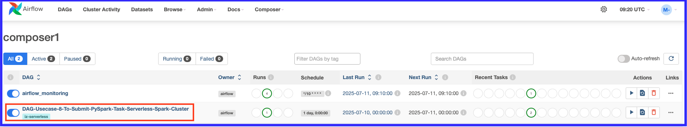
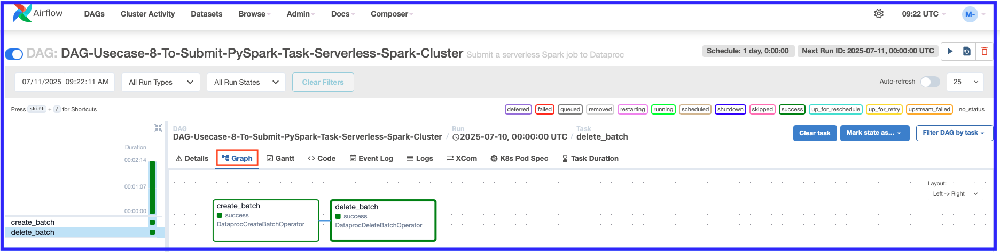

# Use Case #8: Cloud Modernization with Dataproc Serverless for Cost Savings

This project focuses on modernizing data pipelines, achieving significant cost savings, and improving orchestration using Google Cloud's Dataproc Serverless, Composer, and BigQuery services.

## 1. Overview

The primary goal is to leverage serverless technologies to process and transform data, loading it into BigQuery for analysis and visualization. This approach minimizes infrastructure management, optimizes costs, and provides a scalable solution for various data processing needs.

## 2. Architecture

The core architecture revolves around:

* **Google Cloud Storage (GCS):** Stores raw customer data and acts as the source for data processing.
* **Dataproc Serverless:** Executes Spark SQL jobs for Extract, Load, and Transform (ELT) operations. It provides a managed, serverless environment for running Spark workloads without provisioning or managing clusters.
* **Google BigQuery:** Serves as the data warehouse, with data organized into a "Raw Layer" and a "Curated Layer" for different levels of processing and consumption.
* **Google Data Studio (Looker Studio):** Used for visualization and dashboarding of the processed data in BigQuery.
* **Composer (Apache Airflow):** (Implied from "Orchestration" and "Airflow DAG") Orchestrates the entire data pipeline, managing dependencies and scheduling jobs.

## 3. Data Flow

1.  Customer data is stored in **Google Cloud Storage (GCS)**.
2.  **Dataproc Serverless** runs Spark SQL jobs to process this data.
3.  The processed data is loaded into **Google BigQuery**, initially into a "Raw Layer" and then transformed further into a "Curated Layer."
4.  **Google Data Studio** consumes data from BigQuery for reporting and analysis.

## 4. When to Use Serverless (Dataproc Serverless)

Dataproc Serverless is particularly beneficial for:

* **Short-running, on-demand batch jobs:** Ideal for intermittent or event-driven data processing tasks.
* **Minimal infra management:** Eliminates the need to provision, scale, or manage virtual machines and clusters.
* **Cost-efficient workloads:** You only pay for the resources consumed during job execution, leading to significant cost savings compared to always-on clusters.
* **Jobs that can benefit from auto-scaling:** Dataproc Serverless automatically scales resources up or down based on workload demands.

## 5. Usecase 8: Data Loading and Validation Steps

This section outlines the high-level steps for implementing a data loading and validation pipeline using the described architecture:

1.  **Load data into GCS:** Source provider loads data into a GCS location. This often involves a PySpark application running on an On-prem cluster or directly copying data to GCS.
2.  **Create DPLR cluster (if not already created):** This step likely refers to setting up the necessary Dataproc Serverless environment or configurations for running Spark jobs.
3.  **Delete loaded data in BQ (if re-running use case 6):** Prior to a new run, existing data in BigQuery from a previous iteration (e.g., Use Case 6) might be deleted to ensure data freshness or for testing purposes.
4.  **Create DAG Code & Upload to Airflow DAG GCS bucket:** Develop Apache Airflow DAGs to orchestrate the end-to-end pipeline and upload them to the GCS bucket monitored by Composer.
5.  **Monitor the DAG run status in the Airflow UI:** Track the execution and status of the data pipeline jobs through the Composer (Airflow) user interface.
6.  **Validate Serverless Dataproc cluster Spark code completed & data loaded in BQ tables:** Verify that the Dataproc Serverless Spark jobs successfully executed and that the processed data has been correctly loaded into the designated BigQuery tables.

## 6. Getting Started

To implement this solution, you will need:

* A Google Cloud Project
* Enabled APIs for Dataproc, BigQuery, Cloud Storage, and Composer.
* Permissions to create and manage resources in these services.

## 7. Steps to Execute the Use Case:

1. **Make sure Cloud Composer is created (Usecase6) and running**

2. **Delete the tables data in the BigQuery Datasets**

```bash
#Use your local PC/VM and make sure gcloud is already installed
bq query --use_legacy_sql=false "delete from rawds.customer_raw where  1=1;"
bq query --use_legacy_sql=false "delete from curatedds.customer_curated where 1=1;"

#If the BigQuery datasets are not available then create it by issuing the below commands
bq mk rawds
bq mk curatedds
```

3. **Ensure to copy the code into codebase bucket and custs data**
```bash
#Use your local PC/VM and make sure gcloud is already installed
cd ~/Downloads/ 
git clone https://github.com/muralitheda/gcp-cloud-usecases.git #copy his repo url from github  

gsutil cp /home/hduser/Downloads/gcp-cloud-usecases/usecase8-modernization3-gcp-serverless-dataproc-bigquery-airflowcomposer/Usecase8_serverless_spark_gcs_bq_DAG3.py gs://iz-cloud-training-project-bucket/codebase/
gsutil cp /home/hduser/Downloads/gcp-cloud-usecases/usecase8-modernization3-gcp-serverless-dataproc-bigquery-airflowcomposer/Usecase8_serverless_spark_gcs_bq_DAG3_10mins_scheduler.py gs://iz-cloud-training-project-bucket/codebase/
gsutil cp /home/hduser/Downloads/gcp-cloud-usecases/usecase8-modernization3-gcp-serverless-dataproc-bigquery-airflowcomposer/code_Usecase6_step1_gcs_bq.py gs://iz-cloud-training-project-bucket/codebase/

#dataset verification : custs
gsutil cat gs://iz-cloud-training-project-bucket/custs | head -n 5
```

> **Note:** We need to enable the **Private Google Access (On)** in the  **VPC** -> **Subnet** to have the Serverless usecase executed


4. **Create/Download the following DAG Code, modify project_id & upload to the Airflow DAG GCS bucket**
* Note: This DAG is using the same usecase5 pyspark code we generated in usecase6
```python
"""
FileName: Usecase8_serverless_spark_gcs_bq_DAG3.py
"""
from airflow import DAG
from airflow.utils.dates import days_ago
from airflow.providers.google.cloud.operators.dataproc import DataprocCreateBatchOperator
from airflow.providers.google.cloud.operators.dataproc import DataprocDeleteBatchOperator
import datetime
PROJECT_ID = "iz-cloud-training-project"
REGION = "us-central1"
ZONE = "us-central1-a"
PYSPARK_CODE1_URI = "gs://iz-cloud-training-project-bucket/codebase/code_Usecase6_step1_gcs_bq.py"
BIGQUERY_CONNECTOR_JAR="gs://spark-lib/bigquery/spark-3.1-bigquery-0.32.2.jar"
# Define default arguments
default_args = {
    'owner': 'airflow',
    "start_date": days_ago(1),
    'depends_on_past': True,
    'email_on_failure': False,
    'email_on_retry': False,
    'retries': 1}

dag = DAG('DAG-Usecase-8-To-Submit-PySpark-Task-Serverless-Spark-Cluster',
    default_args=default_args,
    description='Submit a serverless Spark job to Dataproc',
    schedule_interval= datetime.timedelta(days=1),  
    tags=['iz-serverless'],)


batch_config = {
    "pyspark_batch": {
        "main_python_file_uri": PYSPARK_CODE1_URI,
		"jar_file_uris": [BIGQUERY_CONNECTOR_JAR]
    },
    "runtime_config": {
        "version": "1.1",
        "properties": {
            "spark.executor.cores": "4",
            "spark.driver.cores": "4",
            "spark.executor.instances": "2",
        },
    },
    "environment_config": {
        "execution_config": {
            "subnetwork_uri": "default",
        },
    },
    "labels": {
        "label": "iz_spark_serverless",
    },
}

create_batch = DataprocCreateBatchOperator(
    task_id='create_batch',
    project_id=PROJECT_ID,
    region=REGION,
    batch=batch_config,
    batch_id='iz-serveless-spark-batch3',
    dag=dag,
)

delete_batch = DataprocDeleteBatchOperator(
    task_id='delete_batch',
    project_id=PROJECT_ID,
    region=REGION,
    batch_id='iz-serveless-spark-batch3',
    trigger_rule='all_done',
    dag=dag,
)

create_batch >> delete_batch

```

5. **Composer Code Copy into the Composer DAGs folder**

* **Option #1 Using gsutil copy into Composer DAGs bucket**  
```bash
gsutil cp gs://iz-cloud-training-project-bucket/codebase/Usecase8_serverless_spark_gcs_bq_DAG3.py gs://us-central1-composer1-de69212f-bucket/dags/
```

6. **Composer UI Navigation:**

    1. **Goto the Composer Airflow Webserver UI – Dag copied in the bucket will be triggered based on the schedule**
    
   
    2. **Click on the Graph to look at the DAG run info including duration, status and logs etc.,**
    

7. **Data validation in BigQueryt dataset using bq command line in local pc/vm**
```bash
bq query --use_legacy_sql=false "select * from rawds.customer_raw limit 10;"
bq query --use_legacy_sql=false "select * from curatedds.customer_curated limit 10;"
```