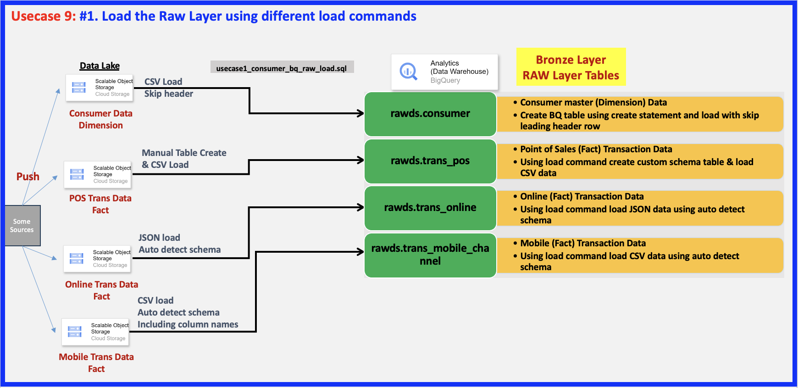

# Cloud Modernization: Public Cloud (SAAS Usecase) - Fully Managed (Serverless) DWH Usecase 9: BigQuery End-to-End Pipeline Building

This document outlines a fully managed, serverless Data Warehouse (DWH) pipeline built on Google BigQuery, designed for robust data ingestion, transformation, analysis, and consumption in a public cloud (SaaS) context.

## Architecture Overview

The pipeline consists of several distinct layers, each serving a specific purpose in the data lifecycle:

### 1. Ingestion/RAW Layer

This is the entry point for raw transactional data. All raw data is ingested into BigQuery.

* **POS Trans Data (CSV Load):**
    * Manual Table Creation & CSV Load into BigQuery.
    * Undergoes processes for Data Discovery, Quality, Masking & Classification, and Views creation.
    * Managed by **Data Stewards**.
* **Online Trans Data (JSON Load):**
    * JSON files are loaded with auto-detection of schema into BigQuery.
* **Mobile Trans Data (CSV Load):**
    * CSV files are loaded with auto-detection of schema, including column names, into BigQuery.
* **Raw Data Analytics:**
    * A dedicated path for **Data Analysts** to directly work with raw data.
* **BigQuery (Overwrite (EL)) Load Command:**
    * Handles `CSV load` with `Skip header` for `Consumer Data`.

### 2. Curated Layer

This layer transforms raw data into a clean, structured, and curated format suitable for analysis.

* **BigQuery ETL (Curation):**
    * Processes include Data Discovery, Data Munging, Data Customization, Data Curation.
    * Supports Incremental/Complete Refresh strategies.

### 3. Analytical Layer

This layer prepares the curated data for various analytical and consumption purposes, focusing on business insights.

* **BigQuery Analytical Processing:**
    * Performs Denormalization, Data Wrangling (join), Aggregation, Consolidation.
    * Calculates Key Performance Indicators (KPI) & Metrics.
    * Enables Analytical & Windowing functions.

### 4. Consumption Layer

The final layer where processed data is consumed by various stakeholders and downstream systems.

* **Visual Analytics & Dashboard:**
    * Utilizes tools like Looker for Visualization & Dashboarding for **Clients & Business Team**.
    * Connects directly to the Analytical Layer.
* **AIML (Artificial Intelligence/Machine Learning):**
    * **Data Scientists** consume data from the Analytical Layer for AI/ML model development and training.
* **Decision Support Systems (KPI & Metrics):**
    * Provides actionable insights for **Clients & Business Team** based on calculated KPIs and metrics.
* **File Export:**
    * Enables data export to `Egress/Downstream Systems/Outbound Feeds`.

## Key Stakeholders

* **Data Stewards:** Responsible for data discovery, quality, masking, classification, and view creation in the RAW Layer.
* **Data Analysts:** Utilize the RAW Layer for immediate raw data analytics.
* **Data Scientists:** Consume data from the Analytical Layer for AI/ML initiatives.
* **Clients & Business Team:** Primary consumers of insights via dashboards, decision support systems, and potentially direct data access.

## Technology Stack

* **Core Data Warehouse:** Google BigQuery (Serverless, Fully Managed)
* **Visualization & Dashboarding:** Looker
* **Data Ingestion:** CSV, JSON (with auto-schema detection capabilities)

## Detail: Loading the RAW (Bronze) Layer
This section details the initial loading process for the RAW Layer (also referred to as the Bronze Layer) using different BigQuery load commands based on data type.

## Step 2

## Step 3

## Step 4