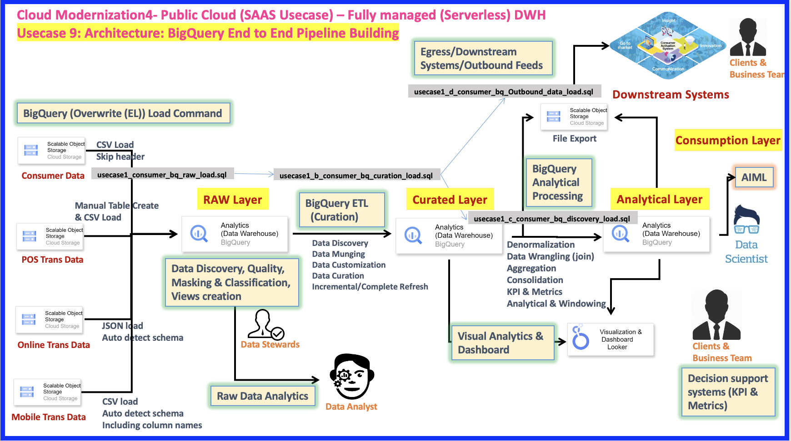
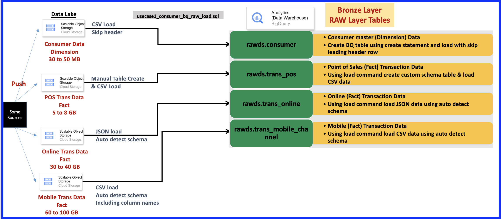
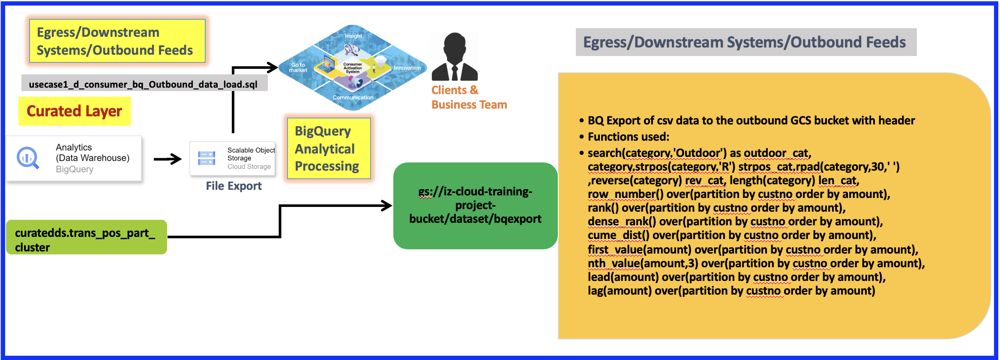

# Cloud Modernization: Public Cloud (SAAS Usecase) - Fully Managed (Serverless) DWH Usecase 9: BigQuery End-to-End Pipeline Building

This document outlines a fully managed, serverless Data Warehouse (DWH) pipeline built on Google BigQuery, designed for robust data ingestion, transformation, analysis, and consumption in a public cloud (SaaS) context.

## Architecture Overview
<details>
  The pipeline consists of several distinct layers, each serving a specific purpose in the data lifecycle:
  <summary> Click to view the E2E diagram </summary>
  
</details>

### 1. Ingestion/RAW Layer

This is the entry point for raw transactional data. All raw data is ingested into BigQuery.

* **POS Trans Data (CSV Load):**
    * Manual Table Creation & CSV Load into BigQuery.
    * Undergoes processes for Data Discovery, Quality, Masking & Classification, and Views creation.
    * Managed by **Data Stewards**.
* **Online Trans Data (JSON Load):**
    * JSON files are loaded with auto-detection of schema into BigQuery.
* **Mobile Trans Data (CSV Load):**
    * CSV files are loaded with auto-detection of schema, including column names, into BigQuery.
* **Raw Data Analytics:**
    * A dedicated path for **Data Analysts** to directly work with raw data.
* **BigQuery (Overwrite (EL)) Load Command:**
    * Handles `CSV load` with `Skip header` for `Consumer Data`.

**Prerequisties:**
```bash
gcloud auth login
```
**Ensure to copy the code into codebase bucket and custs data**
```bash
#Use your local PC/VM and make sure gcloud is already installed
cd ~/Downloads/ 
git clone https://github.com/muralitheda/gcp-cloud-usecases.git #copy his repo url from github  

gsutil cp /home/hduser/Downloads/gcp-cloud-usecases/usecase9-modernization4-gcp-bigquery-serverless/usecase1_d_consumer_bq_Outbound_data_load.sql gs://iz-cloud-training-project-bucket/codebase/
gsutil cp /home/hduser/Downloads/gcp-cloud-usecases/usecase9-modernization4-gcp-bigquery-serverless/usecase1_consumer_bq_raw_load.sql gs://iz-cloud-training-project-bucket/codebase/
gsutil cp /home/hduser/Downloads/gcp-cloud-usecases/usecase9-modernization4-gcp-bigquery-serverless/usecase1_c_consumer_bq_discovery_load.sql gs://iz-cloud-training-project-bucket/codebase/
gsutil cp /home/hduser/Downloads/gcp-cloud-usecases/usecase9-modernization4-gcp-bigquery-serverless/usecase1_b_consumer_bq_curation_load.sql gs://iz-cloud-training-project-bucket/codebase/

gsutil cp /home/hduser/Downloads/gcp-cloud-usecases/usecase9-modernization4-gcp-bigquery-serverless/dataset/*.* gs://iz-cloud-training-project-bucket/datasets/

#dataset verification : custs
gsutil ls gs://iz-cloud-training-project-bucket/dataset/
```
**Step1 :: Loading the source data into BigQuery Raw(Bronze) Layer**  
This section details the initial loading process for the RAW Layer (also referred to as the Bronze Layer) using different BigQuery load commands based on data type.

<details>
  <summary>Click here to view flow diagram</summary>
    
</details>

Either in the BQ Console or using bq command run in Cloud shell use the below query to create a raw tables
```bash
cd ~/Downloads
gsutil cp gs://iz-cloud-training-project-bucket/codebase/usecase1_consumer_bq_raw_load.sql ~/Downloads/
bq query --use_legacy_sql=false < usecase1_consumer_bq_raw_load.sql
```

Data loading techniques from Google Cloud Storage into BigQuery's "RAW Layer":

* **Schema & Logging:** Creates a dataset (`rawds`) and an `audit_meta` table to log loading process steps.
* **Diverse Loading Methods:** Shows `LOAD DATA OVERWRITE` for:
    * CSV with a predefined schema and skipped header rows (`rawds.consumer`).
    * CSV with inline schema definition (`rawds.trans_pos`).
    * JSON with auto-detected schema (`rawds.trans_online`).
    * CSV with auto-detected schema (`rawds.trans_mobile_channel`).
* **Complete Overwrite:** All loads perform a full replacement of existing table data.


### 2. Curated Layer

This layer transforms raw data into a clean, structured, and curated format suitable for analysis.

* **BigQuery ETL (Curation):**
    * Processes include Data Discovery, Data Munging, Data Customization, Data Curation.
    * Supports Incremental/Complete Refresh strategies.

**Step2 :: Loading the BigQuery raw data into BigQuery Curated(Silver) Layer**  
This section details the loading process from the RAW Layer to Curated using different BigQuery PL\SQL building blocks.

<details>
  <summary>Click here to view flow diagram</summary>
    
</details>

Either in the BQ Console or using bq command run in Cloud shell use the below query to create a raw tables
```bash
cd ~/Downloads
gsutil cp gs://iz-cloud-training-project-bucket/codebase/usecase1_b_consumer_bq_curation_load.sql ~/Downloads/
bq query --use_legacy_sql=false < usecase1_b_consumer_bq_curation_load.sql
```

This BigQuery SQL script handles data curation for the `curatedds` layer, applying transformations and loading data into various table types.

**Key Techniques:**

* **Variable Management:** Uses `DECLARE` and `SET` for session-scoped variables (`loadts`, `current_dt`).
* **Schema & Table Definitions:**
    * Creates the `curatedds` schema.
    * Defines tables using `CREATE OR REPLACE TABLE` (for full refresh) and `CREATE TABLE IF NOT EXISTS`.
    * Utilizes BigQuery's **partitioning** (`PARTITION BY loaddt` or `_PARTITIONDATE`) and **clustering** (`CLUSTER BY`) for performance and cost optimization.
* **Data Curation & Transformation:**
    * **Data Cleansing:** Deduplication (`ROW_NUMBER()`), `COALESCE` for null handling, `REGEXP_REPLACE` for string manipulation, `CASE WHEN` for standardization.
    * **Data Enrichment:** Concatenating strings (`CONCAT`), deriving new columns (`yearofbirth`), converting data types (`PARSE_DATE`, `TIMESTAMP`, `ST_GEOGPOINT` for geo-coordinates).
    * **Semi-structured Data Handling:** `UNNEST` to flatten nested JSON structures.
    * **Data Quality:** Corrects future dates to `CURRENT_DATE()`.
* **Loading Strategies:**
    * **Idempotent Loads:** Employs `DELETE FROM` before `INSERT INTO` for partitioned tables to ensure re-runnability, compensating for BigQuery's lack of `INSERT OVERWRITE PARTITION`.
    * **Temporary Tables:** `CREATE OR REPLACE TEMP TABLE` to store intermediate results for complex transformations, improving performance and readability.
    * **Yearly Table Segregation:** Creates separate tables per year (e.g., `_2021`, `_2022`, `_2023`) for mobile transactions, leveraging BigQuery's wildcard query capabilities.
* **Column Selection:** Uses `* EXCEPT()` for concise column selection while performing transformations.
  
### 3. Analytical Layer

This layer prepares the curated data for various analytical and consumption purposes, focusing on business insights.

* **BigQuery Analytical Processing:**
    * Performs Denormalization, Data Wrangling (join), Aggregation, Consolidation.
    * Calculates Key Performance Indicators (KPI) & Metrics.
    * Enables Analytical & Windowing functions.

**Step3 :: Loading the BigQuery Curated data into BigQuery Discovery(Gold) Layer**  
This section details the loading process from the Curated layer to Discovery layer using different BigQuery PL\SQL building blocks.

<details>
  <summary>Click here to view flow diagram</summary>
    
</details>

Either in the BQ Console or using bq command run in Cloud shell use the below query to create a raw tables
```bash
cd ~/Downloads
gsutil cp gs://iz-cloud-training-project-bucket/codebase/usecase1_c_consumer_bq_discovery_load.sql ~/Downloads/
bq query --use_legacy_sql=false < usecase1_c_consumer_bq_discovery_load.sql
```

This BigQuery script creates "Discovery Layer" tables for analytics.

**Key Techniques:**

* **Schema & Table Setup:** Creates `discoveryds` schema and defines denormalized (`consumer_trans_pos_mob_online`) and aggregated (`trans_aggr`) tables.
* **Data Wrangling with CTEs:**
    * Uses `WITH` clauses (`pos_mob_trans`, `cust_online_trans`) to combine data from various curated sources (`FULL JOIN`, `LEFT JOIN`).
    * Employs **wildcard table queries** (`_20*`) for multi-year mobile transaction data.
    * Leverages `COALESCE` and `CASE WHEN` for data consolidation, standardization, and handling missing values across channels.
* **Final Denormalization:** Joins the CTEs to create a wide, comprehensive fact table, prioritizing and merging data intelligently.
* **Aggregation:**
    * `TRUNCATE TABLE` for idempotent loads.
    * Uses `INNER JOIN` to combine necessary data.
    * Applies aggregate functions like `MAX`, `MIN`, `SUM`, `APPROX_COUNT_DISTINCT`, and `COUNTIF` to generate summarized metrics, grouped by key dimensions.

### 4. Consumption Layer

The final layer where processed data is consumed by various stakeholders and downstream systems.

* **Visual Analytics & Dashboard:**
    * Utilizes tools like Looker for Visualization & Dashboarding for **Clients & Business Team**.
    * Connects directly to the Analytical Layer.
* **AIML (Artificial Intelligence/Machine Learning):**
    * **Data Scientists** consume data from the Analytical Layer for AI/ML model development and training.
* **Decision Support Systems (KPI & Metrics):**
    * Provides actionable insights for **Clients & Business Team** based on calculated KPIs and metrics.
* **File Export:**
    * Enables data export to `Egress/Downstream Systems/Outbound Feeds`.
  
**Step4 :: Outbound/Egress/Downstream systems layer**  
This section details the loading process to outbound layer.

<details>
  <summary>Click here to view flow diagram</summary>
    
</details>

Either in the BQ Console or using bq command run in Cloud shell use the below query to create a raw tables
```bash
cd ~/Downloads
gsutil cp gs://iz-cloud-training-project-bucket/codebase/usecase1_d_consumer_bq_Outbound_data_load.sql ~/Downloads/
bq query --use_legacy_sql=false < usecase1_d_consumer_bq_Outbound_data_load.sql
```

This BigQuery SQL script exports data from the `curatedds.trans_pos_part_cluster` table to Google Cloud Storage as CSV.

**Key Techniques:**

* **Data Export:** Uses `EXPORT DATA` to save query results to GCS.
    * **Options:** Specifies `uri` (GCS path with wildcard for sharding), `format` (CSV), `overwrite` (true), `header` (true), and `field_delimiter`.
* **String Functions:**
    * `SEARCH()`: Checks for substring existence.
    * `STRPOS()`: Finds the position of a substring.
    * `RPAD()`: Pads a string to a specified length.
    * `REVERSE()`: Reverses a string.
    * `LENGTH()`: Gets the length of a string.
* **Window Functions (Analytic Functions):** Applied `OVER(PARTITION BY custno ORDER BY amount)` to calculate values based on groups of customer transactions.
    * `ROW_NUMBER()`: Assigns a unique, sequential number within each customer group.
    * `RANK()`: Assigns ranks with gaps for ties.
    * `DENSE_RANK()`: Assigns ranks without gaps for ties.
    * `CUME_DIST()`: Calculates cumulative distribution.
    * `FIRST_VALUE()`: Returns the first value in a window.
    * `NTH_VALUE(n)`: Returns the nth value in a window.
    * `LEAD()`: Accesses data from a subsequent row.
    * `LAG()`: Accesses data from a preceding row.
* **Filtering:** `WHERE loaddt = CURRENT_DATE()` filters data to include only records from the current day.

## Key Stakeholders

* **Data Stewards:** Responsible for data discovery, quality, masking, classification, and view creation in the RAW Layer.
* **Data Analysts:** Utilize the RAW Layer for immediate raw data analytics.
* **Data Scientists:** Consume data from the Analytical Layer for AI/ML initiatives.
* **Clients & Business Team:** Primary consumers of insights via dashboards, decision support systems, and potentially direct data access.

## Technology Stack

* **Core Data Warehouse:** Google BigQuery (Serverless, Fully Managed)
* **Visualization & Dashboarding:** Looker
* **Data Ingestion:** CSV, JSON (with auto-schema detection capabilities)

## Additional MetaData Queries

```sql

--To see the Table column details
select * from iz-cloud-training-project.rawds.INFORMATION_SCHEMA.COLUMNS where table_name='consumer';

--To see the Table DDL & other details
select ddl,* from iz-cloud-training-project.rawds.INFORMATION_SCHEMA.TABLES where table_name='consumer';

--To see the Table partition details
select * from iz-cloud-training-project.curatedds.INFORMATION_SCHEMA.PARTITIONS; 

--To see the Materialized view informations
select * from iz-cloud-training-project.curatedds.INFORMATION_SCHEMA.TABLES where table_type='MATERIALIZED VIEW'; 

```